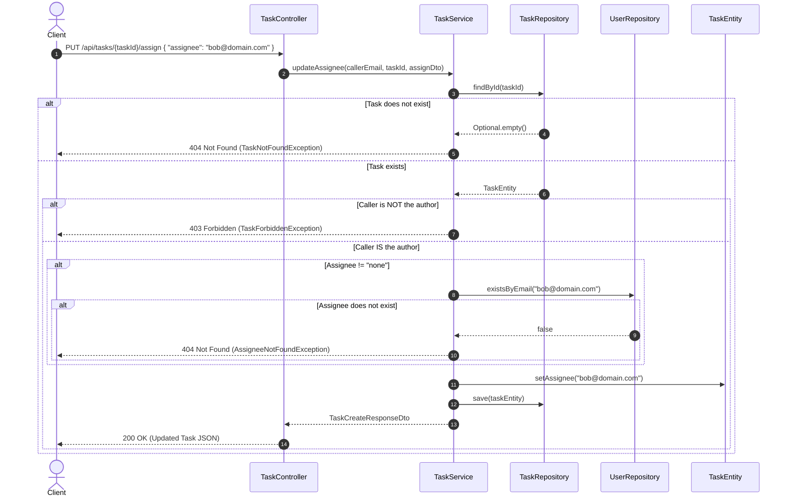

# Task Management: Assigning Tasks & Status Management (Stage 4)

This reference guide documents the domain extensions, business authorization rules, DTO contracts, custom exceptions, and controller endpoints introduced in Stage 4 (Assigning Tasks).

---

## Architecture Overview

Stage 4 introduces collaboration features to the task module: assigning tasks to users, managing lifecycle statuses (`CREATED`, `IN_PROGRESS`, `COMPLETED`), enforcing strict authorization rules on modifications, and translating business exceptions into standard HTTP status codes.

| Component | Layer | File Path | Primary Responsibility |
| :--- | :--- | :--- | :--- |
| **`TaskStatus`** | Domain (Enum) | `taskmanagement/tasks/TaskStatus.java` | Defines task states: `CREATED`, `IN_PROGRESS`, `COMPLETED`. |
| **`TaskEntity`** | Persistence (JPA) | `taskmanagement/tasks/TaskEntity.java` | Extended with an `assignee` field (email string or `"none"`). |
| **`TaskRepository`** | Persistence (Data Access) | `taskmanagement/tasks/TaskRepository.java` | Queries tasks filtered by assignee and/or author ordered chronologically. |
| **`AssignDto`** | Transport (DTO Record) | `taskmanagement/dto/AssignDto.java` | Request body validation for task assignment (`"none"` or valid email format). |
| **`StatusDto`** | Transport (DTO Record) | `taskmanagement/dto/StatusDto.java` | Request body validation for status updates (`@NotNull TaskStatus`). |
| **`TaskListDto`** | Transport (DTO Record) | `taskmanagement/dto/TaskListDto.java` | Response DTO including author, assignee, and status. |
| **`TaskService`** | Business Logic | `taskmanagement/tasks/TaskService.java` | Authorization rules for assigning, status transitions, and assignee existence checks. |
| **Custom Exceptions** | Error Domain | `taskmanagement/exception/` | `TaskNotFoundException`, `AssigneeNotFoundException`, `TaskForbiddenException`. |
| **`GlobalExceptionHandler`** | Web (Exception Handling) | `taskmanagement/exception/GlobalExceptionHandler.java` | Translates domain exceptions into HTTP 404 and HTTP 403 status codes. |
| **`TaskController`** | Web (REST API) | `taskmanagement/controller/TaskController.java` | Exposes `PUT /api/tasks/{taskId}/assign`, `PUT /api/tasks/{taskId}/status`, and filtered `GET /api/tasks`. |

---

## Step 1: Domain Model Updates

### 1.1 Updated Task Lifecycle Enum — `TaskStatus.java`

**Path:** `taskmanagement/tasks/TaskStatus.java`

```java
package taskmanagement.tasks;

public enum TaskStatus {
    CREATED,
    IN_PROGRESS,
    COMPLETED
}
```

* **`CREATED`:** Default state when a task is first created.
* **`IN_PROGRESS`:** Task is currently being worked on by the assignee or author.
* **`COMPLETED`:** Task has been finished.

---

### 1.2 Entity Extension — `TaskEntity.java`

**Path:** `taskmanagement/tasks/TaskEntity.java`

The entity is extended with an `assignee` field:

```java
@Entity
public class TaskEntity {
    // ... id, title, description, status, author, createdAt ...

    private String assignee;

    public String getAssignee() {
        return assignee;
    }

    public void setAssignee(String assignee) {
        this.assignee = assignee;
    }
}
```

* **Default Value:** Upon creation in `TaskService`, `assignee` defaults to `"none"` (indicating unassigned).
* **Storage Format:** Stores either the normalized lowercase email of the assigned user or `"none"`.

---

## Step 2: Persistence Layer Queries — `TaskRepository.java`

**Path:** `taskmanagement/tasks/TaskRepository.java`

The repository introduces derived queries allowing clients to filter tasks by author, assignee, or both simultaneously:

```java
package taskmanagement.tasks;

import org.springframework.data.repository.CrudRepository;

import java.util.List;

public interface TaskRepository extends CrudRepository<TaskEntity, String> {
    List<TaskEntity> findByOrderByCreatedAtDesc();
    List<TaskEntity> findAllByAuthorOrderByCreatedAtDesc(String author);
    List<TaskEntity> findAllByAssigneeOrderByCreatedAtDesc(String assignee);
    List<TaskEntity> findAllByAssigneeAndAuthorOrderByCreatedAtDesc(String assignee, String author);
    TaskEntity getById(String id);
}
```

* **`findAllByAssigneeOrderByCreatedAtDesc(String assignee)`:**
  ```sql
  SELECT * FROM task_entity WHERE assignee = ? ORDER BY created_at DESC;
  ```
* **`findAllByAssigneeAndAuthorOrderByCreatedAtDesc(String assignee, String author)`:**
  ```sql
  SELECT * FROM task_entity WHERE assignee = ? AND author = ? ORDER BY created_at DESC;
  ```

---

## Step 3: DTO Contracts & Validation

### 3.1 Task Assignment Request — `AssignDto.java`

**Path:** `taskmanagement/dto/AssignDto.java`

```java
package taskmanagement.dto;

import jakarta.validation.constraints.NotBlank;
import jakarta.validation.constraints.Pattern;

public record AssignDto(
        @NotBlank(message = "Assignee empty")
        @Pattern(
                regexp = "^(none|[a-zA-Z0-9._%+-]+@[a-zA-Z0-9.-]+\\.[a-zA-Z]{2,})$",
                message = "Assignee must be 'none' or a valid Email"
        )
        String assignee
) {
}
```

* **Regex Pattern Validation:**
  * Rejects empty or invalid strings.
  * Allows the literal string `"none"` (to unassign a task).
  * Validates standard email address formats if an assignee is provided.

---

### 3.2 Task Status Request — `StatusDto.java`

**Path:** `taskmanagement/dto/StatusDto.java`

```java
package taskmanagement.dto;

import jakarta.validation.constraints.NotNull;
import taskmanagement.tasks.TaskStatus;

public record StatusDto(
        @NotNull(message = "Task empty")
        TaskStatus status
) {
}
```

* Uses `@NotNull` on the strongly-typed `TaskStatus` enum. If a client sends an unrecognized status string, Jackson deserialization rejects it before reaching the controller.

---

### 3.3 Task List Response — `TaskListDto.java`

**Path:** `taskmanagement/dto/TaskListDto.java`

```java
package taskmanagement.dto;

import taskmanagement.tasks.TaskEntity;
import taskmanagement.tasks.TaskStatus;

public record TaskListDto(
        String id, 
        String title, 
        String description,
        TaskStatus status, 
        String author, 
        String assignee, 
        int total_comments
) {
    public static TaskListDto from(TaskEntity entity) {
        return new TaskListDto(
                entity.getId(),
                entity.getTitle(),
                entity.getDescription(),
                entity.getStatus(),
                entity.getAuthor(),
                entity.getAssignee(),
                entity.getTotalComments()
        );
    }
}
```

---

## Step 4: Exception Handling & HTTP Mapping

Instead of returning HTTP 500 on business errors, custom exceptions are defined and mapped to clear HTTP status codes.

### 4.1 Custom Business Exceptions

* **`TaskNotFoundException.java`:**
  ```java
  public class TaskNotFoundException extends RuntimeException {
      public TaskNotFoundException(String message) { super(message); }
  }
  ```
* **`AssigneeNotFoundException.java`:**
  ```java
  public class AssigneeNotFoundException extends RuntimeException {
      public AssigneeNotFoundException(String message) { super(message); }
  }
  ```
* **`TaskForbiddenException.java`:**
  ```java
  public class TaskForbiddenException extends RuntimeException {
      public TaskForbiddenException(String message) { super(message); }
  }
  ```

---

### 4.2 Centralized Exception Handler — `GlobalExceptionHandler.java`

**Path:** `taskmanagement/exception/GlobalExceptionHandler.java`

```java
package taskmanagement.exception;

import org.springframework.http.HttpStatus;
import org.springframework.http.ResponseEntity;
import org.springframework.web.bind.annotation.ExceptionHandler;
import org.springframework.web.bind.annotation.RestControllerAdvice;

@RestControllerAdvice
public class GlobalExceptionHandler {

    @ExceptionHandler({TaskNotFoundException.class, AssigneeNotFoundException.class})
    public ResponseEntity<Void> handleNotFound() {
        return ResponseEntity.notFound().build();
    }

    @ExceptionHandler(TaskForbiddenException.class)
    public ResponseEntity<Void> handleForbidden() {
        return ResponseEntity.status(HttpStatus.FORBIDDEN).build();
    }
}
```

#### Concepts & Annotations
* **`@RestControllerAdvice`:** Intercepts exceptions thrown across all `@RestController` classes application-wide.
* **`@ExceptionHandler({TaskNotFoundException.class, AssigneeNotFoundException.class})`:** Returns **HTTP 404 Not Found** when either the task ID or the proposed assignee email does not exist in the database.
* **`@ExceptionHandler(TaskForbiddenException.class)`:** Returns **HTTP 403 Forbidden** when an authenticated user attempts an operation they are not authorized to perform.

---

## Step 5: Business Service Logic — `TaskService.java`

**Path:** `taskmanagement/tasks/TaskService.java`

The service enforces all assignment, permission, and status update rules:

```java
package taskmanagement.tasks;

import org.springframework.stereotype.Service;
import taskmanagement.dto.*;
import taskmanagement.exception.AssigneeNotFoundException;
import taskmanagement.exception.TaskForbiddenException;
import taskmanagement.exception.TaskNotFoundException;
import taskmanagement.user.UserRepository;

import java.util.List;

@Service
public class TaskService {
    private final TaskRepository taskRepository;
    private final UserRepository userRepository;

    public TaskService(TaskRepository taskRepository, UserRepository userRepository) {
        this.taskRepository = taskRepository;
        this.userRepository = userRepository;
    }

    public TaskCreateResponseDto createNewTask(TaskCreateDto taskDto, String username) {
        TaskEntity task = new TaskEntity();
        task.setTitle(taskDto.title());
        task.setDescription(taskDto.description());
        task.setStatus(TaskStatus.CREATED);
        task.setAuthor(username.toLowerCase());
        task.setAssignee("none"); // Initial default assignee
        this.taskRepository.save(task);
        return TaskCreateResponseDto.from(task);
    }

    public TaskCreateResponseDto updateAssignee(String username, String uuid, AssignDto assignDto) {
        TaskEntity task = this.taskRepository.findById(uuid.toLowerCase())
                .orElseThrow(() -> new TaskNotFoundException(uuid + " not Found"));

        // Rule 1: Only the task author can assign or unassign
        if (!task.getAuthor().equals(username.toLowerCase())) {
            throw new TaskForbiddenException("User not allowed to change assignee");
        }

        String newAssignee = assignDto.assignee().toLowerCase();

        // Rule 2: If not unassigning to "none", the assignee email must exist in the database
        if (!"none".equals(newAssignee)) {
            if (!this.userRepository.existsByEmail(newAssignee)) {
                throw new AssigneeNotFoundException("Assignee does not exist");
            }
        }

        task.setAssignee(newAssignee);
        this.taskRepository.save(task);
        return TaskCreateResponseDto.from(task);
    }

    public TaskCreateResponseDto updateTaskStatus(String username, String uuid, StatusDto status) {
        TaskEntity task = taskRepository.findById(uuid.toLowerCase())
                .orElseThrow(() -> new TaskNotFoundException(uuid + " not Found"));

        // Rule 3: Only the Author OR the Assignee can change the task status
        if (!(task.getAssignee().equals(username) || task.getAuthor().equals(username))) {
            throw new TaskForbiddenException("Only Author or Assignee can change task status!");
        }

        task.setStatus(status.status());
        this.taskRepository.save(task);
        return TaskCreateResponseDto.from(task);
    }

    public List<TaskListDto> getAllTasks() {
        return taskRepository.findByOrderByCreatedAtDesc().stream().map(TaskListDto::from).toList();
    }

    public List<TaskListDto> getUserTasks(String username) {
        return taskRepository.findAllByAuthorOrderByCreatedAtDesc(username.toLowerCase()).stream().map(TaskListDto::from).toList();
    }

    public List<TaskListDto> getAssigneeTasks(String assignee) {
        return taskRepository.findAllByAssigneeOrderByCreatedAtDesc(assignee.toLowerCase()).stream().map(TaskListDto::from).toList();
    }

    public List<TaskListDto> getByAssigneeAndByAuthor(String assignee, String username) {
        return taskRepository.findAllByAssigneeAndAuthorOrderByCreatedAtDesc(assignee.toLowerCase(), username.toLowerCase()).stream().map(TaskListDto::from).toList();
    }
}
```

---

### Authorization Rules Summary

| Operation | Endpoint | Permitted Roles | Unauthorized Status |
| :--- | :--- | :--- | :--- |
| **Assign Task** | `PUT /api/tasks/{taskId}/assign` | **Task Author only** (`task.author == currentUser`) | `403 Forbidden` |
| **Change Status** | `PUT /api/tasks/{taskId}/status` | **Author OR Assignee** (`task.author == user` \|\| `task.assignee == user`) | `403 Forbidden` |
| **Assignee Validation** | `PUT /api/tasks/{taskId}/assign` | Proposed email must exist in `users` table (or `"none"`) | `404 Not Found` |

---

## Step 6: Controller Implementation — `TaskController.java`

**Path:** `taskmanagement/controller/TaskController.java`

```java
@RestController
@RequestMapping("/api/tasks")
public class TaskController {

    private final TaskService taskService;
    private final CommentService commentService;

    public TaskController(TaskService taskService, CommentService commentService) {
        this.taskService = taskService;
        this.commentService = commentService;
    }

    @GetMapping
    ResponseEntity<List<TaskListDto>> getTasks(@RequestParam(name = "author", required = false) String author,
                                               @RequestParam(name = "assignee", required = false) String assignee) {
        // Filter by author only
        if (author != null && assignee == null) {
            return ResponseEntity.ok(taskService.getUserTasks(author));
        }
        // Filter by assignee only
        if (author == null && assignee != null) {
            return ResponseEntity.ok(taskService.getAssigneeTasks(assignee));
        }
        // Filter by both author and assignee
        if (author != null && assignee != null) {
            return ResponseEntity.ok(taskService.getByAssigneeAndByAuthor(assignee, author));
        }

        // Return all tasks
        return ResponseEntity.ok(taskService.getAllTasks());
    }

    @PutMapping("{taskId}/assign")
    ResponseEntity<TaskCreateResponseDto> updateAssignee(@Valid @RequestBody AssignDto assignee, 
                                                         @PathVariable String taskId,
                                                         Authentication authentication) {
        TaskCreateResponseDto responseDto = this.taskService.updateAssignee(authentication.getName(), taskId, assignee);
        return ResponseEntity.ok(responseDto);
    }

    @PutMapping("{taskId}/status")
    ResponseEntity<TaskCreateResponseDto> updateStatus(@Valid @RequestBody StatusDto status, 
                                                       @PathVariable String taskId,
                                                       Authentication authentication) {
        TaskCreateResponseDto response = taskService.updateTaskStatus(authentication.getName(), taskId, status);
        return ResponseEntity.ok(response);
    }
}
```

---

## Runtime Execution Flow: Task Assignment



---

## Summary Checklist (Stage 4)

- [x] **TaskStatus:** Added `COMPLETED` state (`CREATED`, `IN_PROGRESS`, `COMPLETED`).
- [x] **Entity Field:** Added `assignee` to `TaskEntity` defaulting to `"none"`.
- [x] **Repository Methods:** Added `findAllByAssignee...` and combined filter queries.
- [x] **DTOs:** Created `AssignDto` (regex for `"none"` or email) and `StatusDto` (`@NotNull`).
- [x] **Authorization:** Enforced author-only assignment modification and author/assignee status changes.
- [x] **Assignee Validation:** Verified proposed assignees exist in `UserRepository`.
- [x] **Exception Handling:** Implemented `@RestControllerAdvice` mapping exceptions to 404 and 403.
- [x] **Controller Endpoints:** Implemented `PUT /api/tasks/{id}/assign` and `PUT /api/tasks/{id}/status`.
