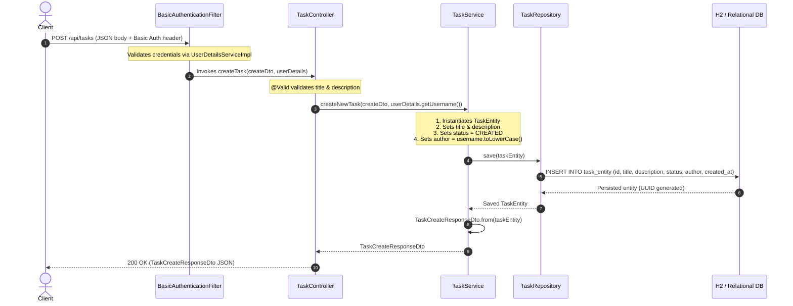

# Task Management: Introduction of Task-Related Modules (Stage 2)

This reference guide documents the domain model, persistence layer, DTO contracts, service architecture, REST endpoints, and security configuration introduced in Stage 2 (Creating Tasks).

---

## Architecture Overview

Stage 2 introduces task management capabilities alongside the user system established in Stage 1. The implementation follows standard layered architecture:

| Component | Layer | File Path | Primary Responsibility |
| :--- | :--- | :--- | :--- |
| **`TaskStatus`** | Domain (Enum) | `taskmanagement/tasks/TaskStatus.java` | Defines task lifecycle states (`CREATED`, `INPROCESS`). |
| **`TaskEntity`** | Persistence (JPA) | `taskmanagement/tasks/TaskEntity.java` | Relational database mapping for tasks using UUID primary keys. |
| **`TaskRepository`** | Persistence (Data Access) | `taskmanagement/tasks/TaskRepository.java` | Spring Data repository providing derived queries with timestamp sorting. |
| **`TaskCreateDto`** | Transport (DTO Record) | `taskmanagement/dto/TaskCreateDto.java` | Input validation contract for task creation requests. |
| **`TaskCreateResponseDto`** | Transport (DTO Record) | `taskmanagement/dto/TaskCreateResponseDto.java` | Output contract returned to API consumers with static factory mapper. |
| **`TaskService`** | Business Logic | `taskmanagement/tasks/TaskService.java` | Business rules, default status assignment, author association, and stream mapping. |
| **`TaskController`** | Web (REST API) | `taskmanagement/controller/TaskController.java` | Endpoints for `GET` and `POST /api/tasks`, query param filtering, `@AuthenticationPrincipal`. |
| **`SecurityConfiguration`** | Security | `taskmanagement/security/SecurityConfiguration.java` | Secures `/api/tasks` endpoints requiring authentication. |

---

## Step 1: The Domain Model — `TaskStatus.java` & `TaskEntity.java`

### 1.1 Task Lifecycle Enum — `TaskStatus.java`

**Path:** `taskmanagement/tasks/TaskStatus.java`

```java
package taskmanagement.tasks;

public enum TaskStatus {
    CREATED,
    INPROCESS
}
```

* **Purpose:** Represents the lifecycle state of a task. Using a typed enum prevents invalid state strings from entering the domain logic.

---

### 1.2 JPA Task Entity — `TaskEntity.java`

**Path:** `taskmanagement/tasks/TaskEntity.java`

```java
package taskmanagement.tasks;

import jakarta.persistence.*;
import jakarta.validation.constraints.NotBlank;
import java.time.Instant;

@Entity
public class TaskEntity {

    @Id
    @GeneratedValue(strategy = GenerationType.UUID)
    private String id;

    @NotBlank
    private String title;

    private String description;

    @Enumerated(EnumType.STRING)
    private TaskStatus status;

    private String author;

    @Column(nullable = false, updatable = false)
    private Instant createdAt = Instant.now();

    public TaskEntity() {
    }

    public String getId() {
        return id;
    }

    public void setId(String id) {
        this.id = id;
    }

    public String getTitle() {
        return title;
    }

    public void setTitle(String title) {
        this.title = title;
    }

    public String getDescription() {
        return description;
    }

    public void setDescription(String description) {
        this.description = description;
    }

    public TaskStatus getStatus() {
        return status;
    }

    public void setStatus(TaskStatus status) {
        this.status = status;
    }

    public String getAuthor() {
        return author;
    }

    public void setAuthor(String author) {
        this.author = author;
    }
}
```

---

### Annotations & Syntax Deep Dive

#### 1. `@GeneratedValue(strategy = GenerationType.UUID)`
* **What it does:** Automatically generates a standard 128-bit Universally Unique Identifier (e.g. `550e8400-e29b-41d4-a716-446655440000`) stored as a `String`.
* **UUID vs. Auto-Increment Numeric ID (`GenerationType.IDENTITY`):**
  * Auto-increment IDs (`1, 2, 3...`) are sequential, exposing task volumes and making endpoints vulnerable to enumeration attacks (`/api/tasks/1`, `/api/tasks/2`).
  * UUIDs are non-sequential, cryptographically unpredictable, and can be generated safely across distributed architectures without primary key collisions.

#### 2. `@Enumerated(EnumType.STRING)`
* **What it does:** Configures how JPA persists the Java enum into the database column.
* **Why `EnumType.STRING` is essential:**
  * By default, JPA uses `EnumType.ORDINAL`, storing the numeric index of the constant (`CREATED = 0`, `INPROCESS = 1`).
  * If new statuses are added or reordered in the enum in the future, all existing database records become corrupted.
  * `EnumType.STRING` persists the literal text (`"CREATED"`, `"INPROCESS"`), ensuring resilience against enum modifications.

#### 3. `@Column(nullable = false, updatable = false)`
* **`nullable = false`:** Adds a database-level `NOT NULL` constraint to the `created_at` column.
* **`updatable = false`:** Instructs Hibernate to exclude `created_at` from SQL `UPDATE` statements after the entity has been initially inserted. This ensures the original creation timestamp remains immutable.

#### 4. `Instant createdAt = Instant.now()`
* Using `java.time.Instant` captures timestamps in UTC timezone, adhering to best practices for server-side persistence.
* Initializing the field at instantiation guarantees that every new entity immediately possesses a timestamp without waiting for a database trigger.

#### 5. Parameterless Constructor
* `public TaskEntity() {}` is mandated by the JPA specification so Hibernate can instantiate empty entity instances via reflection when reading rows from the database.

---

## Step 2: The Persistence Layer — `TaskRepository.java`

**Path:** `taskmanagement/tasks/TaskRepository.java`

```java
package taskmanagement.tasks;

import org.springframework.data.repository.CrudRepository;

import java.util.List;

public interface TaskRepository extends CrudRepository<TaskEntity, String> {
    List<TaskEntity> findByOrderByCreatedAtDesc();
    List<TaskEntity> findAllByAuthorOrderByCreatedAtDesc(String author);
}
```

---

### Syntax & Query Derivation Deep Dive

#### 1. `extends CrudRepository<TaskEntity, String>`
* `TaskEntity`: Managed entity type.
* `String`: Primary key type (matching `@Id private String id` generated via UUID).

#### 2. Derived Query: `findByOrderByCreatedAtDesc()`
* **Keywords parsed:** `find...By` + `OrderBy` + `CreatedAt` + `Desc`.
* **Generated SQL:**
  ```sql
  SELECT * FROM task_entity ORDER BY created_at DESC;
  ```
* **Purpose:** Retrieves all tasks across the system ordered from newest to oldest.

#### 3. Derived Query: `findAllByAuthorOrderByCreatedAtDesc(String author)`
* **Keywords parsed:** `findAllBy` + `Author` + `OrderBy` + `CreatedAt` + `Desc`.
* **Generated SQL:**
  ```sql
  SELECT * FROM task_entity WHERE author = ? ORDER BY created_at DESC;
  ```
* **Purpose:** Filters tasks by author email while maintaining reverse chronological ordering.

---

## Step 3: DTO Contracts — `TaskCreateDto.java` & `TaskCreateResponseDto.java`

### 3.1 Request Payload — `TaskCreateDto.java`

**Path:** `taskmanagement/dto/TaskCreateDto.java`

```java
package taskmanagement.dto;

import jakarta.validation.constraints.NotBlank;

public record TaskCreateDto(
        @NotBlank String title, 
        @NotBlank String description
) {
}
```

* **Record Immutability:** Data transfer objects do not require mutability. Java records provide immutable data carriers with automatic canonical constructor, getters (`title()`, `description()`), `equals()`, and `hashCode()`.
* **Validation:** Both `title` and `description` are marked `@NotBlank` to reject null, empty, or whitespace-only inputs.

---

### 3.2 Response Payload — `TaskCreateResponseDto.java`

**Path:** `taskmanagement/dto/TaskCreateResponseDto.java`

```java
package taskmanagement.dto;

import taskmanagement.tasks.TaskEntity;
import taskmanagement.tasks.TaskStatus;

public record TaskCreateResponseDto(
        String id, 
        String title, 
        String description, 
        TaskStatus status, 
        String author
) {
    public static TaskCreateResponseDto from(TaskEntity entity) {
        return new TaskCreateResponseDto(
                entity.getId(),
                entity.getTitle(),
                entity.getDescription(),
                entity.getStatus(),
                entity.getAuthor()
        );
    }
}
```

* **Decoupling Entities from API:** Returning DTOs prevents internal database structures from leaking to external clients and prevents serialization issues (such as circular references or uninitialized lazy fields).
* **Static Factory Pattern (`from`):** Centralizes entity-to-DTO conversion logic within the record itself, avoiding repetitive boilerplate mappings throughout controllers and services.

---

## Step 4: The Business Service Layer — `TaskService.java`

**Path:** `taskmanagement/tasks/TaskService.java`

The service layer contains business logic, keeping controllers thin and focused solely on HTTP handling.

### The Code

```java
package taskmanagement.tasks;

import org.springframework.stereotype.Service;
import taskmanagement.dto.TaskCreateDto;
import taskmanagement.dto.TaskCreateResponseDto;

import java.util.List;

@Service
public class TaskService {
    private final TaskRepository taskRepository;

    public TaskService(TaskRepository taskRepository) {
        this.taskRepository = taskRepository;
    }

    public TaskCreateResponseDto createNewTask(TaskCreateDto taskDto, String username) {
        TaskEntity task = new TaskEntity();
        task.setTitle(taskDto.title());
        task.setDescription(taskDto.description());
        task.setStatus(TaskStatus.CREATED);
        task.setAuthor(username.toLowerCase());
        this.taskRepository.save(task);
        return TaskCreateResponseDto.from(task);
    }

    public List<TaskCreateResponseDto> getAllTasks() {
        return taskRepository.findByOrderByCreatedAtDesc()
                .stream()
                .map(TaskCreateResponseDto::from)
                .toList();
    }

    public List<TaskCreateResponseDto> getUserTasks(String username) {
        return taskRepository.findAllByAuthorOrderByCreatedAtDesc(username)
                .stream()
                .map(TaskCreateResponseDto::from)
                .toList();
    }
}
```

---

### Mechanics Deep Dive

#### 1. Constructor Injection
* Spring automatically injects `TaskRepository` into `TaskService`. Declaring `private final` guarantees immutability.

#### 2. Business Logic in `createNewTask`
* **Default Status Assignment:** Automatically sets `TaskStatus.CREATED`. The client cannot arbitrarily set or tamper with task status on initial creation.
* **Author Normalization:** Normalizes the author username/email to lowercase (`username.toLowerCase()`) before persisting, maintaining case-insensitive consistency across the database.
* **Persistence & Return:** Saves the entity and transforms the saved instance into `TaskCreateResponseDto` via the static `from` method.

#### 3. Stream Transformation
* `getAllTasks` and `getUserTasks` leverage Java Streams (`.stream().map(TaskCreateResponseDto::from).toList()`) to transform database entities into API response records in a functional, readable style.

---

## Step 5: The REST Controller — `TaskController.java`

**Path:** `taskmanagement/controller/TaskController.java`

Exposes endpoints for creating and querying tasks.

### The Code

```java
package taskmanagement.controller;

import jakarta.validation.Valid;
import org.springframework.http.ResponseEntity;
import org.springframework.security.core.annotation.AuthenticationPrincipal;
import org.springframework.security.core.userdetails.UserDetails;
import org.springframework.web.bind.annotation.*;
import taskmanagement.dto.TaskCreateDto;
import taskmanagement.dto.TaskCreateResponseDto;
import taskmanagement.tasks.TaskService;

import java.util.List;

@RestController
@RequestMapping("/api/tasks")
public class TaskController {

    private final TaskService taskService;

    public TaskController(TaskService taskService) {
        this.taskService = taskService;
    }

    @GetMapping
    ResponseEntity<List<TaskCreateResponseDto>> getTasks(@RequestParam(name = "author", required = false) String author) {
        if (author != null) {
            return ResponseEntity.ok(taskService.getUserTasks(author.toLowerCase()));
        }

        return ResponseEntity.ok(taskService.getAllTasks());
    }

    @PostMapping
    ResponseEntity<TaskCreateResponseDto> createTask(@Valid @RequestBody TaskCreateDto createDto,
                                                     @AuthenticationPrincipal UserDetails userDetails) {
        TaskCreateResponseDto responseDto = this.taskService.createNewTask(createDto, userDetails.getUsername());
        return ResponseEntity.ok(responseDto);
    }
}
```

---

### Annotations & Syntax Deep Dive

#### 1. `@RequestParam(name = "author", required = false) String author`
* Binds optional URL query parameters (e.g. `/api/tasks?author=alice@domain.com`).
* Setting `required = false` allows the parameter to be omitted.
  * When present: Normalizes `author.toLowerCase()` and invokes `taskService.getUserTasks(...)`.
  * When absent (`author == null`): Returns all tasks via `taskService.getAllTasks()`.

#### 2. `@AuthenticationPrincipal UserDetails userDetails`
* **What it does:** Resolves the currently authenticated user principal directly from Spring Security's `SecurityContextHolder`.
* **How it works:** Spring Security extracts the principal from the active `Authentication` token (in this application, the `UserAdapter` object produced during login).
* **Benefit:** Eliminates manual lookup boilerplate (`SecurityContextHolder.getContext().getAuthentication().getPrincipal()`).
* **Author Association:** `userDetails.getUsername()` supplies the authenticated user's email, which is passed to `taskService.createNewTask(...)`.

#### 3. `@Valid @RequestBody TaskCreateDto createDto`
* `@RequestBody`: Deserializes the JSON request body into `TaskCreateDto`.
* `@Valid`: Triggers Jakarta validation. If `title` or `description` are blank, Spring interrupts execution and returns HTTP `400 Bad Request`.

---

## Step 6: Security Configuration — `SecurityConfiguration.java`

**Path:** `taskmanagement/security/SecurityConfiguration.java`

In Stage 1, task routes were not fully configured. In Stage 2, the security filter chain enforces authentication for all task endpoints:

```java
.authorizeHttpRequests(auth -> auth
        .requestMatchers(HttpMethod.POST, "/api/accounts").permitAll()
        .requestMatchers("/api/tasks").authenticated() // Enforces authentication on all /api/tasks routes
        .requestMatchers("/error").permitAll()
        .requestMatchers("/actuator/shutdown").permitAll()
        .requestMatchers("/h2-console/**").permitAll()
        .anyRequest().denyAll()
)
```

* **`.requestMatchers("/api/tasks").authenticated()`:**
  * Without specifying an HTTP method, this rule applies to **all** requests to `/api/tasks` (`GET`, `POST`, etc.).
  * Anonymous clients attempting to create or view tasks receive HTTP `401 Unauthorized`.
  * Authenticated clients (providing valid HTTP Basic credentials) are permitted through to `TaskController`.

---

## End-to-End Runtime Execution: Creating a Task

The diagram below details how Spring Security, the Web Controller, the Service, and the Persistence Layer interact during task creation:



---

## Summary Checklist (Stage 2)

- [x] **TaskStatus:** Typed enum (`CREATED`, `INPROCESS`).
- [x] **TaskEntity:** UUID primary key (`GenerationType.UUID`), string-persisted enum (`EnumType.STRING`), immutable timestamp (`Instant.now()`).
- [x] **TaskRepository:** Derived queries sorted chronologically descending (`findByOrderByCreatedAtDesc`, `findAllByAuthorOrderByCreatedAtDesc`).
- [x] **DTOs:** Immutable records (`TaskCreateDto`, `TaskCreateResponseDto`) with validation and static factory conversion.
- [x] **TaskService:** Separation of business logic, author normalization, stream-based mapping.
- [x] **TaskController:** REST mapping (`/api/tasks`), query filtering (`@RequestParam`), principal injection (`@AuthenticationPrincipal`).
- [x] **Security:** Route protection via `.requestMatchers("/api/tasks").authenticated()`.
