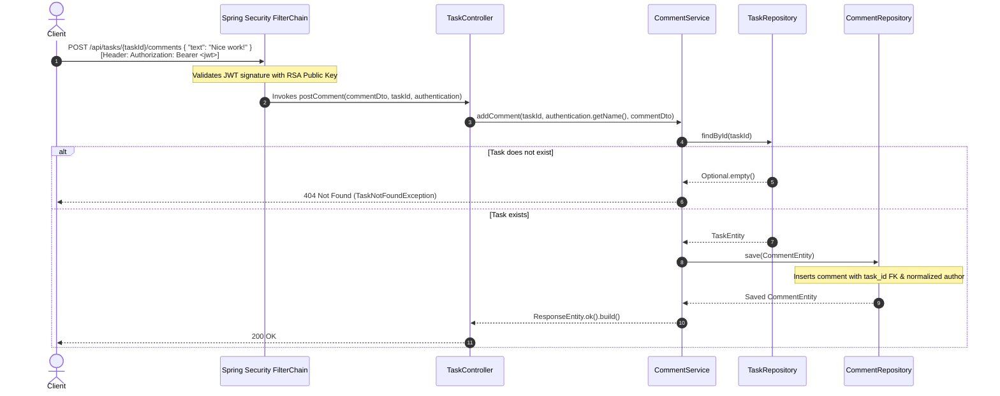

# Task Management: Leaving Comments & JPA Associations (Stage 5)

This reference guide documents the domain relationship modeling, JPA bidirectional associations, Hibernate formulas, DTO contracts, service architecture, and REST endpoints introduced in Stage 5 (Leaving Comments).

---

## Architecture Overview

Stage 5 introduces commenting capabilities to tasks. It establishes a relational parent-child link between tasks and comments (`TaskEntity 1 <---> N CommentEntity`), demonstrates lazy fetching, cascading persistence, calculated fields via Hibernate `@Formula`, and endpoints to add and retrieve task comments.

| Component | Layer | File Path | Primary Responsibility |
| :--- | :--- | :--- | :--- |
| **`CommentEntity`** | Persistence (JPA) | `taskmanagement/comment/CommentEntity.java` | Relational database entity for comments with `@ManyToOne` link to `TaskEntity`. |
| **`TaskEntity`** | Persistence (JPA) | `taskmanagement/tasks/TaskEntity.java` | Extended with `@OneToMany` collection, helper synchronization methods, and `@Formula`. |
| **`CommentRepository`** | Persistence (Data Access) | `taskmanagement/comment/CommentRepository.java` | Custom JPQL query for comments by task ID and derived count query. |
| **`CommentDto`** | Transport (DTO Record) | `taskmanagement/dto/CommentDto.java` | Input validation contract (`@NotBlank String text`) for comment creation. |
| **`CommentResponseDto`** | Transport (DTO Record) | `taskmanagement/dto/CommentResponseDto.java` | Output contract returned to API consumers with static factory mapper. |
| **`TaskListDto`** | Transport (DTO Record) | `taskmanagement/dto/TaskListDto.java` | Task overview record including calculated `total_comments`. |
| **`CommentService`** | Business Logic | `taskmanagement/comment/CommentService.java` | Manages comment persistence, task existence validation, and list retrieval. |
| **`TaskController`** | Web (REST API) | `taskmanagement/controller/TaskController.java` | Exposes `POST` and `GET /api/tasks/{taskId}/comments`. |
| **`SecurityConfiguration`** | Security | `taskmanagement/security/SecurityConfiguration.java` | Secures all sub-resource routes (`/api/tasks/**`) requiring authentication. |

---

## Step 1: The Comment Entity — `CommentEntity.java`

**Path:** `taskmanagement/comment/CommentEntity.java`

`CommentEntity` represents the child table in the relationship. Each comment belongs to exactly one parent `TaskEntity`.

### The Code

```java
package taskmanagement.comment;

import jakarta.persistence.*;
import taskmanagement.tasks.TaskEntity;

import java.time.Instant;

@Entity
@Table(name = "comments")
public class CommentEntity {

    @Id
    @GeneratedValue(strategy = GenerationType.IDENTITY)
    private Long id;

    @ManyToOne(fetch = FetchType.LAZY, optional = false)
    @JoinColumn(name = "task_id")
    private TaskEntity task;

    private String text;

    private String author;

    @Column(nullable = false, updatable = false)
    private Instant createdAt = Instant.now();

    public CommentEntity() {
    }

    public Long getId() {
        return id;
    }

    public void setId(Long id) {
        this.id = id;
    }

    public TaskEntity getTask() {
        return task;
    }

    public void setTask(TaskEntity task) {
        this.task = task;
    }

    public String getText() {
        return text;
    }

    public void setText(String text) {
        this.text = text;
    }

    public String getAuthor() {
        return author;
    }

    public void setAuthor(String author) {
        this.author = author;
    }

    public Instant getCreatedAt() {
        return createdAt;
    }

    public void setCreatedAt(Instant createdAt) {
        this.createdAt = createdAt;
    }
}
```

---

### Annotations & Relationship Deep Dive

#### 1. `@ManyToOne(fetch = FetchType.LAZY, optional = false)`
* **Multiplicity:** Many comments belong to one task.
* **`fetch = FetchType.LAZY`:** Prevents N+1 query performance penalties. When a `CommentEntity` is loaded, Hibernate does not eagerly fetch the parent `TaskEntity` from the database until `getTask()` is explicitly accessed.
* **`optional = false`:** Expresses that a comment cannot exist as an orphan without an associated task (adds an inner join optimization and a `NOT NULL` foreign key rule).

#### 2. `@JoinColumn(name = "task_id")`
* Designates the foreign key column in the `comments` table referencing the primary key of `TaskEntity` (`id`).

#### 3. `@Column(nullable = false, updatable = false)`
* Enforces that `createdAt` cannot be null and prevents Hibernate from issuing updates that modify creation timestamps.

---

## Step 2: Parent Entity Extension — `TaskEntity.java`

**Path:** `taskmanagement/tasks/TaskEntity.java`

To establish a bidirectional relationship, `TaskEntity` is extended with a comments collection, synchronization helper methods, and a calculated comment count.

```java
@Entity
public class TaskEntity {
    // ... id, title, description, status, author, createdAt, assignee ...

    @OneToMany(mappedBy = "task", cascade = CascadeType.ALL, orphanRemoval = true)
    private List<CommentEntity> comments = new ArrayList<>();

    @Formula("(SELECT count(*) FROM comments c WHERE c.task_id = id)")
    private int total_Comments;

    // Helper methods to keep both sides of the relationship synchronized in memory
    public void addComment(CommentEntity comment) {
        this.comments.add(comment);
        comment.setTask(this);
    }

    public void removeComment(CommentEntity comment) {
        this.comments.remove(comment);
        comment.setTask(null);
    }

    public List<CommentEntity> getComments() {
        return comments;
    }

    public void setComments(List<CommentEntity> comments) {
        this.comments = comments;
    }

    public int getTotalComments() {
        return total_Comments;
    }

    public void setTotalComments(int totalComments) {
        this.total_Comments = totalComments;
    }
}
```

---

### Syntax & Mechanics Deep Dive

#### 1. `@OneToMany(mappedBy = "task", cascade = CascadeType.ALL, orphanRemoval = true)`
* **`mappedBy = "task"`:** Declares that `CommentEntity.task` is the **owning side** of the relationship that holds the foreign key. `TaskEntity` is the inverse side.
* **`cascade = CascadeType.ALL`:** Any persistence operation (`PERSIST`, `REMOVE`, `MERGE`) applied to the task automatically cascades down to its comments.
* **`orphanRemoval = true`:** If a comment is removed from the `comments` list in Java, Hibernate automatically executes a SQL `DELETE` for that row in the database.

#### 2. Bidirectional Synchronization Helpers (`addComment` & `removeComment`)
* In object-oriented programming, bidirectional links require updating both sides: adding the comment to the task's list *and* setting the task on the comment object.
* Encapsulating this logic in helper methods prevents state discrepancies in memory before flushing to the database.

#### 3. Hibernate `@Formula`
```java
@Formula("(SELECT count(*) FROM comments c WHERE c.task_id = id)")
private int total_Comments;
```
* **What it does:** Executes a subquery in the SQL `SELECT` statement whenever a `TaskEntity` is fetched.
* **Why this is beneficial:** Enables reading the aggregate comment count directly into entity properties without executing extra `COUNT` queries or loading the entire `comments` collection into memory.

---

## Step 3: Persistence Layer — `CommentRepository.java`

**Path:** `taskmanagement/comment/CommentRepository.java`

```java
package taskmanagement.comment;

import org.springframework.data.jpa.repository.Query;
import org.springframework.data.repository.CrudRepository;
import org.springframework.data.repository.query.Param;
import org.springframework.stereotype.Repository;

import java.util.List;

@Repository
public interface CommentRepository extends CrudRepository<CommentEntity, Long> {

    @Query("SELECT c FROM CommentEntity c WHERE c.task.id = :taskId ORDER BY c.createdAt DESC")
    List<CommentEntity> findAllByTaskId(@Param("taskId") String taskId);

    int countByTask_Id(String taskId);
}
```

* **`@Query(...)`:** Uses JPQL (Java Persistence Query Language) to retrieve comments associated with a specific task ID, sorted in reverse chronological order (`createdAt DESC`).
* **`countByTask_Id(String taskId)`:** Derived query method counting all comment records associated with a specific task identifier.

---

## Step 4: DTO Contracts — `CommentDto.java` & `CommentResponseDto.java`

### 4.1 Request Contract — `CommentDto.java`

**Path:** `taskmanagement/dto/CommentDto.java`

```java
package taskmanagement.dto;

import jakarta.validation.constraints.NotBlank;

public record CommentDto(@NotBlank String text) {
}
```

* Validates that comments submitted to the endpoint contain non-blank text.

---

### 4.2 Response Contract — `CommentResponseDto.java`

**Path:** `taskmanagement/dto/CommentResponseDto.java`

```java
package taskmanagement.dto;

import taskmanagement.comment.CommentEntity;

public record CommentResponseDto(String id, String task_id, String text, String author) {
    public static CommentResponseDto from(CommentEntity comment) {
        return new CommentResponseDto(
                comment.getId().toString(),
                comment.getTask().getId(),
                comment.getText(),
                comment.getAuthor()
        );
    }
}
```

* **Output Mapping:** Decouples internal database entities from external API serialization, transforming numeric ID to string, referencing `task.getId()`, and returning author and text.

---

## Step 5: Service Architecture — `CommentService.java`

**Path:** `taskmanagement/comment/CommentService.java`

```java
package taskmanagement.comment;

import org.springframework.http.ResponseEntity;
import org.springframework.stereotype.Service;
import taskmanagement.dto.CommentDto;
import taskmanagement.dto.CommentResponseDto;
import taskmanagement.exception.TaskNotFoundException;
import taskmanagement.tasks.TaskEntity;
import taskmanagement.tasks.TaskRepository;

import java.util.List;

@Service
public class CommentService {
    private final TaskRepository taskRepository;
    private final CommentRepository commentRepository;

    public CommentService(TaskRepository taskRepository, CommentRepository commentRepository) {
        this.commentRepository = commentRepository;
        this.taskRepository = taskRepository;
    }

    public ResponseEntity<Void> addComment(String taskId, String user, CommentDto dto) {
        TaskEntity task = taskRepository.findById(taskId)
                .orElseThrow(() -> new TaskNotFoundException("No such Task"));

        CommentEntity comment = new CommentEntity();
        comment.setTask(task);
        comment.setAuthor(user.toLowerCase());
        comment.setText(dto.text());
        commentRepository.save(comment);

        return ResponseEntity.ok().build();
    }

    public List<CommentResponseDto> getTaskCommentList(String taskId) {
        if (!taskRepository.existsById(taskId)) {
            throw new TaskNotFoundException("No such Task");
        }

        return commentRepository.findAllByTaskId(taskId).stream()
                .map(CommentResponseDto::from)
                .toList();
    }

    public int amountComments(String taskId) {
        return this.commentRepository.countByTask_Id(taskId);
    }
}
```

---

### Mechanics & Business Rules Deep Dive

1. **Existence Verification:**
   * Both `addComment` and `getTaskCommentList` verify whether the target task exists using `taskRepository.findById` or `taskRepository.existsById`.
   * If the task does not exist, a `TaskNotFoundException` is thrown, which the `GlobalExceptionHandler` converts into HTTP **404 Not Found**.
2. **Author Normalization:**
   * The authenticated user's email is converted to lowercase (`user.toLowerCase()`) prior to saving, maintaining database consistency across lookups.
3. **Empty Response Body on Creation:**
   * `addComment` returns `ResponseEntity.ok().build()` (HTTP 200 with no body) to confirm creation.

---

## Step 6: REST Controller Endpoints — `TaskController.java`

**Path:** `taskmanagement/controller/TaskController.java`

Endpoints for managing comments are mapped under the `/api/tasks` hierarchy:

```java
@PostMapping("{taskId}/comments")
ResponseEntity<Void> postComment(@Valid @RequestBody CommentDto commentDto, 
                                 @PathVariable String taskId,
                                 Authentication authentication) {
    return commentService.addComment(taskId, authentication.getName(), commentDto);
}

@GetMapping("{taskId}/comments")
ResponseEntity<List<CommentResponseDto>> getAllComments(@PathVariable String taskId) {
    return ResponseEntity.ok(commentService.getTaskCommentList(taskId));
}
```

* **`POST /api/tasks/{taskId}/comments`:**
  * Reads the target task ID from `@PathVariable String taskId`.
  * Injects authenticated caller email via `Authentication.getName()`.
  * Validates the request body with `@Valid @RequestBody CommentDto`.
* **`GET /api/tasks/{taskId}/comments`:**
  * Returns a list of comments ordered chronologically descending for the specified task.

---

## Step 7: Security Filter Chain Rule Updates

**Path:** `taskmanagement/security/SecurityConfiguration.java`

To ensure sub-resource endpoints like `/api/tasks/{taskId}/comments`, `/api/tasks/{taskId}/assign`, and `/api/tasks/{taskId}/status` are protected, wildcard route matching was configured:

```java
.authorizeHttpRequests(auth -> auth
        .requestMatchers(HttpMethod.POST, "/api/accounts").permitAll()
        .requestMatchers("/api/tasks").authenticated()
        .requestMatchers("/api/auth/token").authenticated()
        .requestMatchers("/api/tasks/**").authenticated() // Secures all sub-resource routes
        .requestMatchers("/error").permitAll()
        .requestMatchers("/actuator/shutdown").permitAll()
        .requestMatchers("/h2-console/**").permitAll()
        .anyRequest().denyAll()
)
.headers(headers -> headers
        .frameOptions(frameOptions -> frameOptions.sameOrigin())) // Enables H2 web console frames
```

* **`/api/tasks/**`:** Matches any nested sub-paths under `/api/tasks/`, enforcing authentication for task comments and updates.
* **`frameOptions.sameOrigin()`:** Allows H2 database console frames from the same origin while protecting against cross-origin clickjacking attacks.

---

## Runtime Execution Flow: Leaving a Comment



---

## Summary Checklist (Stage 5)

- [x] **CommentEntity:** Created child entity with `@ManyToOne(fetch = FetchType.LAZY)` and `@JoinColumn(name = "task_id")`.
- [x] **TaskEntity Relationship:** Extended parent entity with `@OneToMany(mappedBy = "task", cascade = CascadeType.ALL, orphanRemoval = true)`.
- [x] **Hibernate Formula:** Added `@Formula` for dynamic subquery calculation of `total_Comments`.
- [x] **Bidirectional Synchronization:** Implemented `addComment` and `removeComment` helper methods.
- [x] **CommentRepository:** Implemented JPQL query with reverse-chronological ordering (`findAllByTaskId`).
- [x] **DTOs:** Implemented `CommentDto` validation and `CommentResponseDto` mapping.
- [x] **CommentService:** Encapsulated task validation, lowercase author persistence, and retrieval.
- [x] **Endpoints:** Exposed `POST` and `GET /api/tasks/{taskId}/comments`.
- [x] **Security Wildcards:** Configured `/api/tasks/**` route protection and H2 `sameOrigin` frame options.
