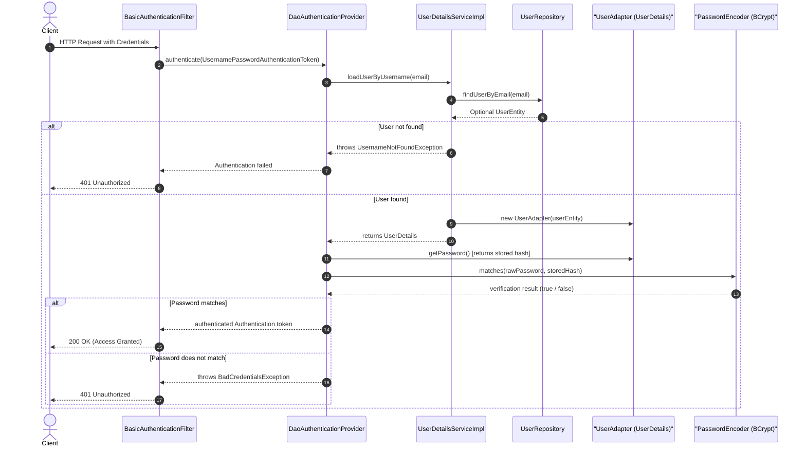

# Spring Security & User Setup: Step-by-Step Reference Guide

---

## Architecture Overview

User management and authentication in Spring Boot rely on a series of coordinated components:

1. **Step 1: `UserEntity`** (JPA Entity)
   Maps directly to a database table to store user data.
2. **Step 2: `UserRepository`** (Spring Data Repository)
   Performs database operations (queries, saves, checks) without manual SQL.
3. **Step 3: `CreateUserRequest`** (DTO / Record)
   Safely receives and validates user input coming from HTTP requests.
4. **Step 4: `UserController`** (REST Controller)
   Exposes HTTP endpoints (such as `POST /api/accounts`) for client interactions.
5. **Step 5: `UserAdapter`** (`UserDetails`)
   Translates the domain `UserEntity` into Spring Security's native user format.
6. **Step 6: `UserDetailsServiceImpl`** (`UserDetailsService`)
   Loads user data from the database during authentication.
7. **Step 7: `SecurityConfiguration`**
   Defines password hashing (`BCryptPasswordEncoder`) and security filter chain rules.

---

## Comparison: Roles of the `User*` Classes

The project contains several classes prefixed with `User`. Each belongs to a distinct architectural layer and fulfills a single responsibility:

| Class / Interface | Architectural Layer | Primary Responsibility | Why It Exists |
| :--- | :--- | :--- | :--- |
| **`UserEntity`** | Persistence / Domain | Database table mapping (JPA). | Stores fields (`id`, `email`, `password`) in the `users` table. Contains no Spring Security logic. |
| **`UserRepository`** | Persistence / Data Access | Database query interface. | Spring Data repository providing built-in CRUD operations and derived queries (`findUserByEmail`, `existsByEmail`). |
| **`UserController`** | Web / REST API | HTTP request routing. | Receives HTTP calls (`POST /api/accounts`), triggers validation, verifies duplicates, and saves accounts. |
| **`UserAdapter`** | Security / Bridge | Implements `UserDetails`. | Adapter pattern: wraps `UserEntity` and translates its methods into what Spring Security requires. |
| **`UserDetailsServiceImpl`** | Security / Service | Implements `UserDetailsService`. | Identity lookup strategy: queries `UserRepository` by email and returns a `UserAdapter` during login. |

---

## Step 1: The Database Model — `UserEntity.java`

**Path:** `taskmanagement/user/UserEntity.java`

The entity is a Java class that represents a relational table in the database. JPA (Java Persistence API) and Hibernate use annotations to map class fields to database columns.

### The Code

```java
package taskmanagement.user;

import jakarta.persistence.*;

@Entity
@Table(name = "users")
public class UserEntity {

    @Id
    @GeneratedValue(strategy = GenerationType.IDENTITY)
    private long id;

    @Column(nullable = false)
    private String email;

    private String password;

    // Parameterless constructor required by JPA
    public UserEntity() {
    }

    public UserEntity(String email) {
        this.email = email;
    }

    public String getEmail() {
        return email;
    }

    public void setEmail(String email) {
        this.email = email;
    }

    public String getPassword() {
        return password;
    }

    public void setPassword(String password) {
        this.password = password;
    }
}
```

---

### Annotations Deep Dive

#### 1. `@Entity`
* **What it does:** Marks the class as a persistent database entity.
* **Effect:** Instructs Hibernate to manage this object and map it to a database table. Without this annotation, Spring Data repositories cannot interact with the class.

#### 2. `@Table(name = "users")`
* **What it does:** Specifies the explicit name of the database table (`users`).
* **Why it matters:** By default, JPA uses the entity class name (`user`). In most SQL dialects (PostgreSQL, H2, Oracle), **`USER` is a reserved SQL keyword**. Naming the table `users` prevents SQL syntax errors during table creation and queries.

#### 3. `@Id`
* **What it does:** Designates the field as the **Primary Key** of the database table. Every JPA entity requires exactly one primary key.

#### 4. `@GeneratedValue(strategy = GenerationType.IDENTITY)`
* **What it does:** Configures the primary key generation strategy.
* **Why `IDENTITY`:** Delegates ID generation to the database's native auto-increment mechanism (`AUTO_INCREMENT` or `SERIAL`). The database automatically generates a unique incremental number when a new row is inserted.

#### 5. `@Column(nullable = false)`
* **What it does:** Defines schema-level column constraints. `nullable = false` adds a `NOT NULL` constraint to the `email` column in the database schema.
* **Fields without `@Column`:** Any field without an explicit `@Column` annotation (like `password`) is still mapped to a column with the same name. Adding `@Column(nullable = false)` to `password` is also standard practice to prevent null passwords from persisting.

---

### Mechanics: The Parameterless Constructor

```java
public UserEntity() {
}
```

* **Why JPA requires it:** When Hibernate queries rows from the database, it creates Java instances using **Java Reflection** (`Class.getDeclaredConstructor().newInstance()`). Reflection does not know what arguments to supply to custom parameterized constructors. A no-argument constructor allows Hibernate to instantiate an empty object first, then populate its fields.
* **Visibility tip:** Making this constructor `protected UserEntity() {}` satisfies JPA requirements while preventing arbitrary external code from creating uninitialized instances.

---

## Step 2: The Persistence Layer — `UserRepository.java`

**Path:** `taskmanagement/user/UserRepository.java`

This interface abstracts data access operations, removing the need for manual SQL statements or JDBC boilerplate.

### The Code

```java
package taskmanagement.user;

import org.springframework.data.repository.CrudRepository;
import org.springframework.stereotype.Repository;

import java.util.Optional;

@Repository
public interface UserRepository extends CrudRepository<UserEntity, Long> {
    Optional<UserEntity> findUserByEmail(String email);
    boolean existsByEmail(String email);
}
```

---

### Syntax & Concepts Deep Dive

#### 1. Interface Declaration vs. Class
* Repositories are declared as interfaces. Spring Data JPA detects them at application startup and generates dynamic proxy implementations containing the actual SQL logic.

#### 2. `extends CrudRepository<UserEntity, Long>`
* **Generic Parameters `<T, ID>`:**
  * `T`: The entity type being managed (`UserEntity`).
  * `ID`: The wrapper type of the primary key (`Long`).
* **Inherited Methods:**
  * `save(entity)`: Inserts or updates an entity.
  * `findById(id)`: Queries an entity by primary key.
  * `findAll()`: Returns all records in the table.
  * `deleteById(id)`: Deletes a record by ID.
  * `count()`: Returns the total number of records.

#### 3. `@Repository`
* **What it does:** Marks the interface as a Spring-managed component (bean) for dependency injection.
* **Exception Translation:** Catches vendor-specific SQLExceptions and translates them into Spring's unified `DataAccessException` hierarchy.

#### 4. Derived Query Methods
Spring Data derives SQL queries directly from method names:

* **`Optional<UserEntity> findUserByEmail(String email);`**
  * Spring parses `find...By` and `Email`, translating it to: `SELECT * FROM users WHERE email = ?`.
  * Wrapping the result in `Optional` avoids returning `null` when no record matches, protecting downstream logic from `NullPointerException`.
* **`boolean existsByEmail(String email);`**
  * Spring parses `exists...By` and `Email`, generating an existence query: `SELECT COUNT(*) > 0 FROM users WHERE email = ?`.
  * Returns `true` if an account with that email exists, allowing fast duplicate checks during registration.

---

## Step 3: Input Validation & Transfer — `CreateUserRequest.java`

**Path:** `taskmanagement/dto/CreateUserRequest.java`

This class serves as a **Data Transfer Object (DTO)**. It defines the contract for user input sent in registration requests and enforces validation rules before data reaches the application logic.

### The Code

```java
package taskmanagement.dto;

import jakarta.validation.constraints.Email;
import jakarta.validation.constraints.NotBlank;
import jakarta.validation.constraints.Size;

public record CreateUserRequest(
        @NotBlank(message = "no email given")
        @Email(message = "invalid email format")
        String email,

        @NotBlank(message = "password can't be empty")
        @Size(min = 6, message = "Password must have at least 6 characters")
        String password) {
}
```

---

### Syntax & Annotations Deep Dive

#### 1. Java `record` Syntax
* Introduced in Java 16, a `record` is a concise syntax for immutable data carriers.
* The compiler automatically generates:
  * `private final` fields for all declared components (`email`, `password`).
  * A public canonical constructor.
  * Accessor methods named after the fields: `email()` and `password()` (not `getEmail()`).
  * `equals()`, `hashCode()`, and `toString()` implementations.
* **Why records are ideal for DTOs:** Incoming HTTP request bodies are read-only input snapshots. Records guarantee immutability without boilerplate getters or builder methods.

#### 2. Validation Annotations (Jakarta Bean Validation)

* **`@NotBlank`**
  * **Rule:** The string must not be `null`, and its trimmed length must be greater than zero.
  * **Difference from `@NotNull` and `@NotEmpty`:**
    * `@NotNull`: Allows `""` (empty string) and `"   "` (spaces).
    * `@NotEmpty`: Allows `"   "` (spaces).
    * `@NotBlank`: Rejects both empty strings and whitespace-only strings.

* **`@Email`**
  * **Rule:** Validates that the string matches standard email formatting (e.g., contains `@` and a valid domain format).
  * The `message` parameter customizes the error description sent if validation fails.

* **`@Size(min = 6)`**
  * **Rule:** Validates the string length against specified minimum and maximum bounds.
  * Prevents insecure short passwords before hashing.

---

## Step 4: The REST Endpoint — `UserController.java`

**Path:** `taskmanagement/controller/UserController.java`

The controller acts as the entry point for HTTP requests. It routes incoming requests, applies validation, triggers duplicate checks and password encoding, and persists the new user.

### The Code

```java
package taskmanagement.controller;

import jakarta.validation.Valid;
import org.springframework.http.HttpStatus;
import org.springframework.http.ResponseEntity;
import org.springframework.security.crypto.password.PasswordEncoder;
import org.springframework.web.bind.annotation.PostMapping;
import org.springframework.web.bind.annotation.RequestBody;
import org.springframework.web.bind.annotation.RequestMapping;
import org.springframework.web.bind.annotation.RestController;
import taskmanagement.dto.CreateUserRequest;
import taskmanagement.user.UserEntity;
import taskmanagement.user.UserRepository;

@RestController
@RequestMapping("/api/accounts")
public class UserController {
    private final UserRepository repository;
    private final PasswordEncoder encoder;

    public UserController(UserRepository repository, PasswordEncoder encoder) {
        this.repository = repository;
        this.encoder = encoder;
    }

    @PostMapping
    ResponseEntity<Void> registerUser(@Valid @RequestBody CreateUserRequest newUserDto) {
        if (repository.existsByEmail(newUserDto.email())) {
            return ResponseEntity.status(HttpStatus.CONFLICT).build();
        }

        String encodedPassword = encoder.encode(newUserDto.password());

        UserEntity newUser = new UserEntity();
        newUser.setEmail(newUserDto.email());
        newUser.setPassword(encodedPassword);
        repository.save(newUser);

        return ResponseEntity.ok().build();
    }
}
```

---

### Annotations & Architecture Deep Dive

#### 1. `@RestController`
* **What it does:** Combines `@Controller` and `@ResponseBody`.
* **Effect:** Declares the class as an HTTP request handler. Every method return value is serialized directly into the HTTP response body (typically JSON) rather than being resolved as an HTML view template.

#### 2. `@RequestMapping("/api/accounts")`
* **What it does:** Sets the base URI path for all endpoints defined in this controller. Any method-level mapping appends to this path.

#### 3. Constructor Dependency Injection
```java
private final UserRepository repository;
private final PasswordEncoder encoder;

public UserController(UserRepository repository, PasswordEncoder encoder) {
    this.repository = repository;
    this.encoder = encoder;
}
```
* **How it works:** Spring automatically detects single constructors in `@RestController` classes and injects required beans (`UserRepository` and `PasswordEncoder`) without needing an explicit `@Autowired` annotation.
* **Why this is preferred:** Fields are marked `final`, ensuring immutability. Dependencies are clearly visible and can be mocked easily in unit tests.

#### 4. `@PostMapping`
* **What it does:** Maps HTTP `POST` requests sent to `/api/accounts` to the `registerUser` method.

#### 5. `@Valid`
* **What it does:** Triggers Jakarta Bean Validation on the argument object (`CreateUserRequest`).
* **Runtime behavior:** If any field violation occurs (e.g. invalid email format or password shorter than 6 characters), Spring interrupts execution and immediately returns an HTTP `400 Bad Request`. The controller method body is never executed.

#### 6. `@RequestBody`
* **What it does:** Instructs Spring's message converters (Jackson) to read the raw HTTP request body JSON and deserialize it into a `CreateUserRequest` Java object.

#### 7. `ResponseEntity<Void>` & HTTP Status Codes
* **`ResponseEntity<T>`:** Represents the complete HTTP response, including status code, headers, and body. Using `<Void>` signifies that the response contains no body payload.
* **Status `409 Conflict` (`HttpStatus.CONFLICT`):** Returned when `repository.existsByEmail(...)` is `true`, signaling that the account already exists.
* **Status `200 OK` (`ResponseEntity.ok().build()`):** Confirms successful persistence.

#### 8. Password Hashing
```java
String encodedPassword = encoder.encode(newUserDto.password());
```
* Raw passwords must never be stored directly in the database.
* The injected `PasswordEncoder` (configured as `BCryptPasswordEncoder`) hashes the plaintext password with a salt, producing a secure hash before setting it on `UserEntity`.

---

## Step 5: The Security Adapter — `UserAdapter.java`

**Path:** `taskmanagement/security/UserAdapter.java`

Spring Security has no knowledge of custom classes like `UserEntity`. It operates exclusively with objects implementing its native interface: `UserDetails`. 

`UserAdapter` applies the **Adapter (or Wrapper) Pattern**: it wraps a `UserEntity` and provides the methods `UserDetails` expects.

### The Code

```java
package taskmanagement.security;

import org.springframework.security.core.GrantedAuthority;
import org.springframework.security.core.userdetails.UserDetails;
import taskmanagement.user.UserEntity;

import java.util.Collection;
import java.util.List;

public class UserAdapter implements UserDetails {
    private final UserEntity user;

    public UserAdapter(UserEntity user) {
        this.user = user;
    }

    @Override
    public String getPassword() {
        return this.user.getPassword();
    }

    @Override
    public String getUsername() {
        return this.user.getEmail();
    }

    @Override
    public Collection<? extends GrantedAuthority> getAuthorities() {
        return List.of();
    }

    @Override
    public boolean isAccountNonExpired() {
        return UserDetails.super.isAccountNonExpired();
    }

    @Override
    public boolean isAccountNonLocked() {
        return UserDetails.super.isAccountNonLocked();
    }

    @Override
    public boolean isCredentialsNonExpired() {
        return UserDetails.super.isCredentialsNonExpired();
    }

    @Override
    public boolean isEnabled() {
        return UserDetails.super.isEnabled();
    }
}
```

---

### Syntax & Mechanics Deep Dive

#### 1. Why Not Implement `UserDetails` Directly on `UserEntity`?
* Directly adding `implements UserDetails` to `UserEntity` mixes database persistence concerns with security framework dependencies.
* Using an adapter keeps `UserEntity` a clean POJO focused solely on database mapping. If the security framework changes or requires extra fields, the database table remains unaffected.

#### 2. Methods Required by `UserDetails`
* **`getUsername()`**: Returns the unique identifier used by Spring Security for authentication. Since this application authenticates with email, this returns `this.user.getEmail()`.
* **`getPassword()`**: Returns the stored, hashed password (`this.user.getPassword()`). Spring Security uses this value to verify against the raw password provided at login.
* **`getAuthorities()`**: Returns a collection of permissions or roles granted to the user (e.g. `ROLE_USER`, `ROLE_ADMIN`). Returning `List.of()` indicates a default authenticated user with no specific role authorities.
* **Account Status Flags**:
  * `isAccountNonExpired()`: Has the account expired?
  * `isAccountNonLocked()`: Is the account locked out (e.g. after too many failed attempts)?
  * `isCredentialsNonExpired()`: Has the password expired?
  * `isEnabled()`: Is the account active?
  * Calling `UserDetails.super.is...()` defaults each to `true` (standard active account).

---

## Step 6: The User Lookup Service — `UserDetailsServiceImpl.java`

**Path:** `taskmanagement/security/UserDetailsServiceImpl.java`

When an authentication request arrives, Spring Security needs a standard way to find the user in the database. It delegates this lookup to an implementation of the `UserDetailsService` interface.

### The Code

```java
package taskmanagement.security;

import org.springframework.security.core.userdetails.UserDetails;
import org.springframework.security.core.userdetails.UserDetailsService;
import org.springframework.security.core.userdetails.UsernameNotFoundException;
import org.springframework.stereotype.Service;
import taskmanagement.user.UserRepository;

@Service
public class UserDetailsServiceImpl implements UserDetailsService {
    private final UserRepository repository;

    public UserDetailsServiceImpl(UserRepository repository) {
        this.repository = repository;
    }

    @Override
    public UserDetails loadUserByUsername(String email) throws UsernameNotFoundException {
        return repository.findUserByEmail(email)
                .map(UserAdapter::new)
                .orElseThrow(() -> new UsernameNotFoundException("Email not found: " + email));
    }
}
```

---

### Annotations & Syntax Deep Dive

#### 1. `@Service`
* Marks this class as a Spring Service Bean in the service layer.
* Spring Security automatically detects any bean implementing `UserDetailsService` in the application context and configures its default authentication provider (`DaoAuthenticationProvider`) to use it.

#### 2. The `loadUserByUsername` Contract
* Signature: `UserDetails loadUserByUsername(String username) throws UsernameNotFoundException;`
* Spring Security calls this method during login, passing the username (here, the email) from the incoming request.
* **Execution Flow:**
  1. `repository.findUserByEmail(email)` queries the database via Spring Data JPA.
  2. `.map(UserAdapter::new)`: If the user is found, wraps the `UserEntity` inside a new `UserAdapter` (which satisfies the `UserDetails` return type).
  3. `.orElseThrow(...)`: If the email does not exist, throws `UsernameNotFoundException`. Spring Security catches this exception and halts authentication, responding with `401 Unauthorized`.

*(Note: The constructor in `UserDetailsServiceImpl.java` can omit the unused `PasswordEncoder encoder` parameter).*

---

## Runtime Flow: How `UserDetails` and Login Interact

When a client sends an authenticated request (for example, using HTTP Basic Authentication with an `Authorization` header), Spring Security coordinates the components to verify credentials.

### Interaction Sequence Diagram



### Detailed Interaction Steps

1. **Header Extraction:** The client sends an HTTP request containing `Authorization: Basic base64(email:password)`. `BasicAuthenticationFilter` extracts the plain email and password.
2. **Authentication Delegation:** The filter creates an unauthenticated `UsernamePasswordAuthenticationToken` and passes it to `DaoAuthenticationProvider`.
3. **User Lookup:** `DaoAuthenticationProvider` calls `UserDetailsServiceImpl.loadUserByUsername(email)`.
4. **Database Query:** `UserDetailsServiceImpl` queries `UserRepository.findUserByEmail(email)`.
5. **Adapter Construction:** `UserEntity` is retrieved and wrapped in `UserAdapter`. The adapter is returned to `DaoAuthenticationProvider` as a `UserDetails` instance.
6. **Password Verification:** `DaoAuthenticationProvider` calls `userAdapter.getPassword()` to get the stored hash, then invokes `passwordEncoder.matches(rawPassword, storedHash)`.
7. **Security Context Creation:**
   * If the passwords match: A fully authenticated token containing the user principal and authorities is stored in `SecurityContextHolder`, and the request proceeds.
   * If credentials fail or the user does not exist: Spring Security terminates the request with HTTP `401 Unauthorized`.

---

## Step 7: Security Configuration — `SecurityConfiguration.java`

**Path:** `taskmanagement/security/SecurityConfiguration.java`

In Spring Boot 3 and Spring Security 6+, security setup is component-based rather than class-inheritance-based. This class configures the security filter chain, endpoint access rules, session management, CSRF settings, and the password hashing algorithm.

### The Code

```java
package taskmanagement.security;

import org.springframework.context.annotation.Bean;
import org.springframework.context.annotation.Configuration;
import org.springframework.http.HttpMethod;
import org.springframework.security.config.Customizer;
import org.springframework.security.config.annotation.web.builders.HttpSecurity;
import org.springframework.security.config.annotation.web.configurers.AbstractHttpConfigurer;
import org.springframework.security.config.http.SessionCreationPolicy;
import org.springframework.security.crypto.bcrypt.BCryptPasswordEncoder;
import org.springframework.security.crypto.password.PasswordEncoder;
import org.springframework.security.web.SecurityFilterChain;

@Configuration
public class SecurityConfiguration {

    @Bean
    public SecurityFilterChain securityFilterChain(HttpSecurity http) throws Exception {
        return http
                .httpBasic(Customizer.withDefaults()) // enable basic HTTP authentication
                .authorizeHttpRequests(auth -> auth
                        .requestMatchers(HttpMethod.POST, "/api/accounts").permitAll()
                        .requestMatchers("/error").permitAll() // expose the /error endpoint
                        .requestMatchers("/actuator/shutdown").permitAll() // required for tests
                        .requestMatchers("/h2-console/**").permitAll() // expose H2 console
                        .anyRequest().denyAll()
                )
                .csrf(AbstractHttpConfigurer::disable) // allow modifying requests from tests
                .sessionManagement(sessions ->
                        sessions.sessionCreationPolicy(SessionCreationPolicy.STATELESS) // no session
                )
                .build();
    }

    @Bean
    public PasswordEncoder passwordEncoder() {
        return new BCryptPasswordEncoder();
    }
}
```

---

### Annotations & Configuration Deep Dive

#### 1. `@Configuration`
* Marks this class as a source of bean definitions for the Spring application context.
* Spring processes `@Configuration` classes using CGLIB proxies, guaranteeing that calls to `@Bean` methods return singleton instances.

#### 2. `@Bean`
* Placed on factory methods. Tells the Spring IoC container to manage the returned object as a Spring Bean.
* Two critical beans are exposed:
  * `SecurityFilterChain`: Intercepts and validates every incoming HTTP request.
  * `PasswordEncoder`: Shared hashing utility across the entire application.

#### 3. Lambda DSL Syntax (Spring Security 6+)
* Modern Spring Security uses lambda expressions (`auth -> auth...`, `sessions -> ...`, `AbstractHttpConfigurer::disable`) to configure security features in a scoped, readable manner, replacing older deprecated chained methods.

#### 4. The `SecurityFilterChain` Rules

* **`.httpBasic(Customizer.withDefaults())`**
  * Enables HTTP Basic Authentication.
  * Expects clients to supply credentials in the standard header: `Authorization: Basic base64(email:password)`.

* **`.authorizeHttpRequests(...)`**
  * Defines route-level access rules evaluated in top-to-bottom order:
    * `.requestMatchers(HttpMethod.POST, "/api/accounts").permitAll()`: Allows anonymous clients to create accounts. Restricting to `HttpMethod.POST` prevents unauthorized `GET` or `DELETE` requests to the registration path.
    * `.requestMatchers("/error").permitAll()`: Exposes default error dispatching so clients receive structured error payloads instead of empty `403 Forbidden` responses when exceptions occur.
    * `.requestMatchers("/actuator/shutdown").permitAll()`: Required by test runners and automated assessment platforms to stop the application gracefully.
    * `.requestMatchers("/h2-console/**").permitAll()`: Grants access to the in-memory H2 database browser interface during local development and testing.
    * `.anyRequest().denyAll()`: Blocks all other routes that are not explicitly permitted. (When protected resources such as `/api/tasks` are implemented, this can be transitioned to `.anyRequest().authenticated()`).

* **`.csrf(AbstractHttpConfigurer::disable)`**
  * Disables Cross-Site Request Forgery (CSRF) protection.
  * **Why CSRF is disabled for REST APIs:** CSRF attacks rely on browsers automatically attaching stored session cookies to cross-origin requests. Because this REST API is stateless and authenticates via headers (`Authorization: Basic`), CSRF is not a vector. Disabling CSRF allows clients (such as curl, mobile apps, or test harnesses) to submit `POST` requests without needing CSRF tokens.

* **`.sessionManagement(sessions -> sessions.sessionCreationPolicy(SessionCreationPolicy.STATELESS))`**
  * Configures Spring Security to never create an `HttpSession` or store security context in cookies (`JSESSIONID`).
  * Every request must supply its own credentials independently, ensuring stateless horizontal scalability.

* **`.build()`**
  * Assembles the rules into a `DefaultSecurityFilterChain` bean registered in the servlet container.

#### 5. The `PasswordEncoder` Bean
```java
@Bean
public PasswordEncoder passwordEncoder() {
    return new BCryptPasswordEncoder();
}
```
* Exposes `BCryptPasswordEncoder` as a `PasswordEncoder` bean.
* **Where it is used:**
  1. **Registration:** Injected into `UserController` to compute a salted cryptographic hash of raw passwords before database insertion.
  2. **Login:** Used automatically by Spring Security's `DaoAuthenticationProvider` to verify the incoming raw password against the stored database hash (`matches(rawPassword, encodedPassword)`).
* **Why BCrypt:** Uses an adaptive cryptographic hashing function with built-in random salting and a configurable work factor, making rainbow table attacks and brute-force cracking computationally impractical.

---

## Component Status & Roadmap

- [x] **Step 1: Entity** (`UserEntity.java`) — Table mapping, `@Id`, `@GeneratedValue`, constraints, reflection constructor.
- [x] **Step 2: Repository** (`UserRepository.java`) — Spring Data interface, derived query methods, `Optional`.
- [x] **Step 3: DTO & Validation** (`CreateUserRequest.java`) — Java record syntax, `@Valid`, `@NotBlank`, `@Email`, `@Size`.
- [x] **Step 4: REST Controller** (`UserController.java`) — `@RestController`, `@PostMapping`, constructor injection, `@RequestBody`, `@Valid`, status codes.
- [x] **Step 5: Security Adapter** (`UserAdapter.java`) — Bridge pattern implementing Spring Security's `UserDetails`.
- [x] **Step 6: User Lookup Service** (`UserDetailsServiceImpl.java`) — Implementing `UserDetailsService` to fetch credentials during login.
- [x] **Step 7: Security Configuration** (`SecurityConfiguration.java`) — Configuring `SecurityFilterChain`, CSRF, authorization rules, and `PasswordEncoder` bean.

