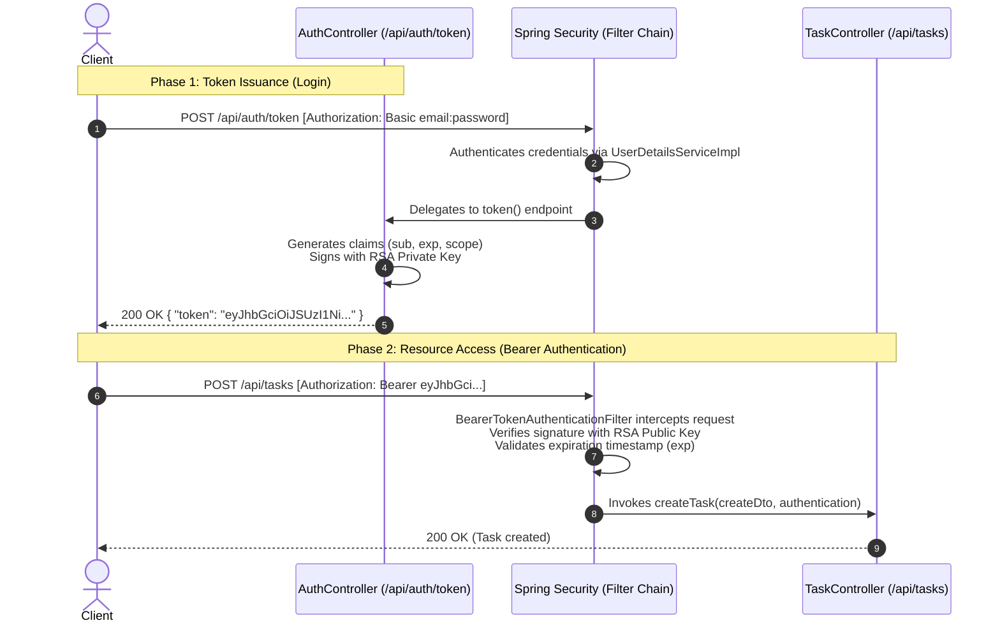

# Spring Boot & Spring Security: Adding JWT (Stage 3)

This reference guide documents the transition from pure HTTP Basic authentication to stateless JSON Web Token (JWT) authentication using Spring Security's OAuth2 Resource Server and RSA asymmetric cryptography.

---

## Part 1: Conceptual Overview — What are JWTs and How Do They Work?

### 1. What is a JSON Web Token (JWT)?

A JSON Web Token (RFC 7519) is a compact, URL-safe, self-contained standard for securely transmitting information between a client and a server as a JSON object.

#### Stateful (Sessions) vs. Stateless (JWT) Authentication

* **Session-Based Authentication:**
  * When a user logs in, the server creates a session record in memory or a database and sends back a session cookie (`JSESSIONID`).
  * On every single subsequent request, the server must query its session storage to verify the user.
  * In distributed systems or microservices, sharing session storage requires sticky sessions, Redis clusters, or distributed caches.

* **JWT-Based Authentication:**
  * The token itself is **self-contained**: it holds the user identity, expiration timestamp, and granted roles.
  * The server signs the token using cryptographic keys.
  * On subsequent requests, the server does **not** query a database or cache. It mathematically verifies the cryptographic signature on the token. If the signature is valid and the expiration time has not elapsed, the request is immediately authenticated.

---

### 2. Structure of a JWT

A JWT consists of three Base64Url-encoded parts separated by periods (`.`):

```text
header.payload.signature
```

```
eyJhbGciOiJSUzI1NiIsInR5cCI6IkpXVCJ9
.
eyJzdWIiOiJ1c2VyQGV4YW1wbGUuY29tIiwiZXhwIjoxNjk1ODI1MjAwLCJzY29wZSI6W119
.
k7Z2v...[cryptographic signature]
```

1. **Header:**
   * Contains metadata about the token type and the hashing algorithm used.
   * Example: `{"alg": "RS256", "typ": "JWT"}`.
2. **Payload (Claims):**
   * Contains claims (statements about an entity, typically the user, and additional data).
   * **Standard Registered Claims:**
     * `sub` (Subject): The principal identifier (in this application, the user's email).
     * `iat` (Issued At): Timestamp when the token was created.
     * `exp` (Expiration Time): Timestamp after which the token is rejected.
   * **Custom Claims:**
     * `scope`: Roles or authorities granted to the user.
3. **Signature:**
   * Created by taking the encoded header, the encoded payload, and signing them with a cryptographic key.
   * If any character in the header or payload is modified in transit, the signature validation fails and Spring Security rejects the token with HTTP `401 Unauthorized`.

---

### 3. Asymmetric Cryptography: RSA (Public & Private Keys)

This application uses **RS256** (RSA Signature with SHA-256), an asymmetric signing algorithm:

* **Private Key:**
  * Kept secret by the authorization server.
  * Used exclusively to **sign** new JWTs when a user logs in.
* **Public Key:**
  * Can be safely distributed to any resource server or service.
  * Used exclusively to **verify** that the token was signed by the matching private key and has not been altered.

---

### 4. The Two-Phase Authentication Lifecycle



1. **Phase 1 (Token Issuance):** The client provides HTTP Basic credentials (`email:password`) to `POST /api/auth/token`. The server validates the credentials, signs a JWT with the RSA private key, and returns `{ "token": "..." }`.
2. **Phase 2 (Token Consumption):** The client attaches the token in the `Authorization` header (`Authorization: Bearer <token>`) on all subsequent API calls. Spring Security verifies the signature using the RSA public key without querying the database.

---

## Part 2: Step-by-Step Code Deep Dive — Adding JWT to Spring Boot

---

### Step 1: Adding the OAuth2 Resource Server Dependency

**File:** `build.gradle`

```groovy
dependencies {
    implementation 'org.springframework.boot:spring-boot-starter-security'
    implementation 'org.springframework.boot:spring-boot-starter-validation'
    implementation 'org.springframework.boot:spring-boot-starter-data-jpa'
    implementation 'org.springframework.boot:spring-boot-starter-oauth2-resource-server'
    runtimeOnly 'com.h2database:h2'
}
```

* **`spring-boot-starter-oauth2-resource-server`:**
  * Pulls in Nimbus JOSE + JWT libraries.
  * Provides Spring Security's `BearerTokenAuthenticationFilter`, `JwtDecoder`, and `JwtEncoder` interfaces.
  * Enables automatic extraction and validation of Bearer tokens from the `Authorization` request header.

---

### Step 2: Generating RSA Cryptographic Keys — `RsaKeysConfig.java`

**Path:** `taskmanagement/security/RsaKeysConfig.java`

To use asymmetric RS256 signing, an RSA key pair must be generated.

```java
package taskmanagement.security;

import org.springframework.context.annotation.Bean;
import org.springframework.context.annotation.Configuration;

import java.security.KeyPair;
import java.security.KeyPairGenerator;
import java.security.NoSuchAlgorithmException;

@Configuration
public class RsaKeysConfig {

    @Bean
    public KeyPair generateRsaKeys() throws NoSuchAlgorithmException {
        KeyPairGenerator keyPairGenerator = KeyPairGenerator.getInstance("RSA");
        keyPairGenerator.initialize(2048);
        return keyPairGenerator.generateKeyPair();
    }
}
```

#### Syntax & Concepts

1. **`KeyPairGenerator.getInstance("RSA")`**
   * Initializes standard RSA public/private key generation using the Java Cryptography Architecture (JCA).
2. **`keyPairGenerator.initialize(2048)`**
   * Sets the key size to 2048 bits, providing cryptographic security compliant with industry standards.
3. **`@Bean KeyPair`**
   * Exposes the `KeyPair` object to the Spring IoC container so that both the encoder (private key) and the decoder (public key) can inject it.

---

### Step 3: Configuring JWT Infrastructure — `SecurityConfiguration.java`

**Path:** `taskmanagement/security/SecurityConfiguration.java`

This class defines the encoder, decoder, JWK source beans, and instructs the security filter chain to accept both HTTP Basic authentication and OAuth2 Bearer tokens.

```java
package taskmanagement.security;

import com.nimbusds.jose.jwk.JWKSet;
import com.nimbusds.jose.jwk.RSAKey;
import com.nimbusds.jose.jwk.source.ImmutableJWKSet;
import com.nimbusds.jose.jwk.source.JWKSource;
import com.nimbusds.jose.proc.SecurityContext;
import org.springframework.context.annotation.Bean;
import org.springframework.context.annotation.Configuration;
import org.springframework.http.HttpMethod;
import org.springframework.security.config.Customizer;
import org.springframework.security.config.annotation.web.builders.HttpSecurity;
import org.springframework.security.config.annotation.web.configurers.AbstractHttpConfigurer;
import org.springframework.security.config.http.SessionCreationPolicy;
import org.springframework.security.crypto.bcrypt.BCryptPasswordEncoder;
import org.springframework.security.crypto.password.PasswordEncoder;
import org.springframework.security.oauth2.jwt.JwtDecoder;
import org.springframework.security.oauth2.jwt.JwtEncoder;
import org.springframework.security.oauth2.jwt.NimbusJwtDecoder;
import org.springframework.security.oauth2.jwt.NimbusJwtEncoder;
import org.springframework.security.web.SecurityFilterChain;

import java.security.KeyPair;
import java.security.interfaces.RSAPublicKey;
import java.util.UUID;

@Configuration
public class SecurityConfiguration {

    @Bean
    public SecurityFilterChain securityFilterChain(HttpSecurity http) throws Exception {
        return http
                .httpBasic(Customizer.withDefaults()) // Enable HTTP Basic (used to obtain a token)
                .oauth2ResourceServer(oauth2 -> oauth2.jwt(Customizer.withDefaults())) // Enable Bearer JWT verification
                .authorizeHttpRequests(auth -> auth
                        .requestMatchers(HttpMethod.POST, "/api/accounts").permitAll()
                        .requestMatchers("/api/tasks").authenticated()
                        .requestMatchers("/api/auth/token").authenticated()
                        .requestMatchers("/error").permitAll()
                        .requestMatchers("/actuator/shutdown").permitAll()
                        .requestMatchers("/h2-console/**").permitAll()
                        .anyRequest().denyAll()
                )
                .csrf(AbstractHttpConfigurer::disable)
                .sessionManagement(sessions ->
                        sessions.sessionCreationPolicy(SessionCreationPolicy.STATELESS)
                )
                .build();
    }

    @Bean
    public PasswordEncoder passwordEncoder() {
        return new BCryptPasswordEncoder();
    }

    @Bean
    public JwtDecoder jwtDecoder(KeyPair keyPair) {
        return NimbusJwtDecoder.withPublicKey((RSAPublicKey) keyPair.getPublic()).build();
    }

    @Bean
    public JWKSource<SecurityContext> jwkSource(KeyPair keyPair) {
        RSAKey rsaKey = new RSAKey.Builder((RSAPublicKey) keyPair.getPublic())
                .privateKey(keyPair.getPrivate())
                .keyID(UUID.randomUUID().toString())
                .build();

        JWKSet jwkSet = new JWKSet(rsaKey);
        return new ImmutableJWKSet<>(jwkSet);
    }

    @Bean
    public JwtEncoder jwtEncoder(JWKSource<SecurityContext> jwkSource) {
        return new NimbusJwtEncoder(jwkSource);
    }
}
```

---

### Annotations & Beans Deep Dive

#### 1. `.oauth2ResourceServer(oauth2 -> oauth2.jwt(Customizer.withDefaults()))`
* Registers `BearerTokenAuthenticationFilter` in Spring Security's filter chain.
* When a request arrives with an `Authorization: Bearer <token>` header:
  1. The filter extracts the token string.
  2. Passes the token to the configured `JwtDecoder`.
  3. If valid, converts it into a `JwtAuthenticationToken` and stores it in `SecurityContextHolder`.

#### 2. Dual Authentication Endpoints
* **`POST /api/auth/token`:** Requires authentication. Clients call this with `Authorization: Basic base64(email:password)` to obtain their JWT.
* **`GET` & `POST /api/tasks`:** Protected routes. Clients can access them using the Bearer token (`Authorization: Bearer <jwt>`).

#### 3. `JwtDecoder` Bean
```java
@Bean
public JwtDecoder jwtDecoder(KeyPair keyPair) {
    return NimbusJwtDecoder.withPublicKey((RSAPublicKey) keyPair.getPublic()).build();
}
```
* **Purpose:** Verifies incoming tokens.
* **Mechanism:** Configured with `(RSAPublicKey) keyPair.getPublic()`. It checks the cryptographic signature using only the **public** key and verifies standard claims (such as ensuring the token has not expired).

#### 4. `JWKSource<SecurityContext>` & `JwtEncoder` Beans
```java
@Bean
public JWKSource<SecurityContext> jwkSource(KeyPair keyPair) {
    RSAKey rsaKey = new RSAKey.Builder((RSAPublicKey) keyPair.getPublic())
            .privateKey(keyPair.getPrivate())
            .keyID(UUID.randomUUID().toString())
            .build();

    JWKSet jwkSet = new JWKSet(rsaKey);
    return new ImmutableJWKSet<>(jwkSet);
}

@Bean
public JwtEncoder jwtEncoder(JWKSource<SecurityContext> jwkSource) {
    return new NimbusJwtEncoder(jwkSource);
}
```
* **Purpose:** Signs outgoing tokens.
* **Mechanism:** Wraps both the public and private keys into a JSON Web Key Set (`JWKSet`). The `NimbusJwtEncoder` uses this source to sign JWT claims with the **private** key.

---

### Step 4: The Token DTO — `TokenDto.java`

**Path:** `taskmanagement/dto/TokenDto.java`

```java
package taskmanagement.dto;

public record TokenDto(String token) {
}
```

* Compact Java record representing the JSON response structure returned to the client:
  ```json
  {
    "token": "eyJhbGciOiJSUzI1NiIsInR5cCI6IkpXVCJ9..."
  }
  ```

---

### Step 5: The Token Issuance Controller — `AuthController.java`

**Path:** `taskmanagement/controller/AuthController.java`

Handles requests to `/api/auth/token` by reading the authenticated user's credentials and generating a signed JWT.

```java
package taskmanagement.controller;

import java.time.Instant;
import java.time.temporal.ChronoUnit;
import java.util.List;

import org.springframework.http.ResponseEntity;
import org.springframework.security.core.Authentication;
import org.springframework.security.core.GrantedAuthority;
import org.springframework.security.oauth2.jwt.JwtClaimsSet;
import org.springframework.security.oauth2.jwt.JwtEncoder;
import org.springframework.security.oauth2.jwt.JwtEncoderParameters;
import org.springframework.web.bind.annotation.PostMapping;
import org.springframework.web.bind.annotation.RequestMapping;
import org.springframework.web.bind.annotation.RestController;
import taskmanagement.dto.TokenDto;

@RestController
@RequestMapping("/api/auth/token")
public class AuthController {

    private final JwtEncoder jwtEncoder;

    public AuthController(JwtEncoder jwtEncoder) {
        this.jwtEncoder = jwtEncoder;
    }

    @PostMapping()
    public ResponseEntity<TokenDto> token(Authentication authentication) {
        List<String> authorities = authentication.getAuthorities().stream()
                .map(GrantedAuthority::getAuthority)
                .toList();

        JwtClaimsSet claimsSet = JwtClaimsSet.builder()
                .subject(authentication.getName())
                .issuedAt(Instant.now())
                .expiresAt(Instant.now().plus(60, ChronoUnit.SECONDS))
                .claim("scope", authorities)
                .build();

        return ResponseEntity.ok(new TokenDto(jwtEncoder.encode(JwtEncoderParameters.from(claimsSet))
                .getTokenValue()));
    }
}
```

---

### Syntax & Mechanics Deep Dive

#### 1. Injected `Authentication` Parameter
* Because `/api/auth/token` requires authentication in `SecurityConfiguration`, Spring Security's `BasicAuthenticationFilter` verifies the client's `Authorization: Basic` header before reaching this controller method.
* Spring injects the resulting `Authentication` object directly into the method.
* `authentication.getName()` returns the authenticated user's email.

#### 2. Building the `JwtClaimsSet`
* **`.subject(authentication.getName())`:** Sets the standard `sub` claim to the user's email.
* **`.issuedAt(Instant.now())`:** Sets the standard `iat` claim to current UTC time.
* **`.expiresAt(Instant.now().plus(60, ChronoUnit.SECONDS))`:** Sets the standard `exp` claim. The token is valid for exactly 60 seconds, enforcing short-lived token lifetimes for security.
* **`.claim("scope", authorities)`:** Serializes the user's granted authorities into the `scope` claim.

#### 3. Signing the Token with `JwtEncoder`
```java
jwtEncoder.encode(JwtEncoderParameters.from(claimsSet)).getTokenValue()
```
* Compiles the header and payload claims, signs the hash using the RSA private key, and returns the compact dot-separated token string.

---

### Step 6: Universal Authentication in Resource Controllers — `TaskController.java`

**Path:** `taskmanagement/controller/TaskController.java`

When supporting both HTTP Basic and JWT Bearer tokens, how the controller resolves the current user requires a subtle but critical adjustment:

```diff
     @PostMapping
     ResponseEntity<TaskCreateResponseDto> createTask(@Valid @RequestBody TaskCreateDto createDto,
-                                                     @AuthenticationPrincipal UserDetails userDetails) {
-        TaskCreateResponseDto responseDto = this.taskService.createNewTask(createDto, userDetails.getUsername());
+                                                     Authentication authentication) {
+        TaskCreateResponseDto responseDto = this.taskService.createNewTask(createDto, authentication.getName());
         return ResponseEntity.ok(responseDto);
     }
```

#### Why Change from `@AuthenticationPrincipal UserDetails` to `Authentication`?

1. **The Type Mismatch Problem:**
   * When authenticated via **HTTP Basic**, the principal object is `UserAdapter` (which implements `UserDetails`).
   * When authenticated via **OAuth2 Bearer Token (JWT)**, Spring Security creates a `JwtAuthenticationToken` where the principal is an instance of `org.springframework.security.oauth2.jwt.Jwt`, **not** `UserDetails`.
   * Declaring `@AuthenticationPrincipal UserDetails userDetails` causes a `ClassCastException` or injects `null` when a JWT Bearer token is used!

2. **The Solution (`Authentication.getName()`):**
   * Injecting `Authentication` and calling `authentication.getName()` works uniformly across all authentication mechanisms:
     * Under HTTP Basic: returns `UserDetails.getUsername()`.
     * Under JWT: returns the JWT `sub` (subject) claim.
   * Both return the user's email string cleanly without manual type checking.

---

## Summary Checklist (Stage 3)

- [x] **Dependency:** Added `spring-boot-starter-oauth2-resource-server` to `build.gradle`.
- [x] **Key Generation:** Configured 2048-bit RSA `KeyPair` bean in `RsaKeysConfig.java`.
- [x] **JWT Infrastructure:** Configured `JwtDecoder` (public key), `JWKSource`, and `JwtEncoder` (private key) in `SecurityConfiguration.java`.
- [x] **Filter Chain:** Activated `.oauth2ResourceServer(...)` and protected `/api/auth/token`.
- [x] **Token DTO:** Created `TokenDto` record to encapsulate the returned token value.
- [x] **Token Endpoint:** Implemented `AuthController` to generate short-lived signed JWTs.
- [x] **Controller Compatibility:** Updated `TaskController` to use `Authentication.getName()` for seamless compatibility with both Basic Auth and Bearer JWTs.
