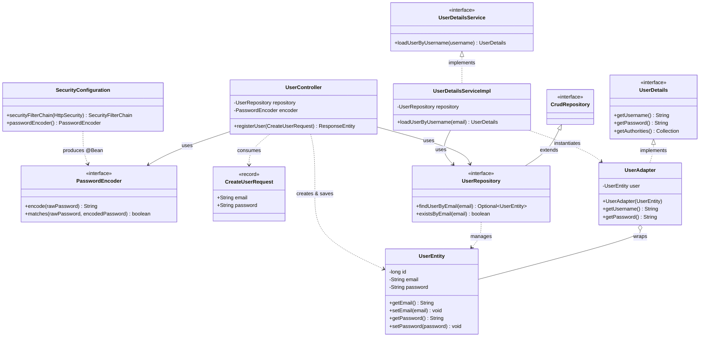

# Task Management System: Spring Boot & Security Setup

This guide documents the core architecture, class dependencies, and best practices for setting up user management and authentication using Spring Boot 3 and Spring Security.

---

## 1. Architecture & Class Overview

The application follows a layered architecture with a clear separation of concerns across the REST layer (Controllers & DTOs), data persistence (Entities & Repositories), and security/authentication.

| Class / Interface | Package | Type | Core Responsibility |
| :--- | :--- | :--- | :--- |
| `CreateUserRequest` | `taskmanagement.dto` | Java Record | **Data Transfer Object (DTO)**: Encapsulates incoming user registration data, including validation constraints (`@Email`, `@Size`, `@NotBlank`). |
| `UserEntity` | `taskmanagement.user` | JPA Entity | **Database Model**: Maps to the `users` table and stores persistent user details (id, email, hashed password). |
| `UserRepository` | `taskmanagement.user` | Spring Data Repository | **Persistence Layer**: Provides standard CRUD and finder methods (`findUserByEmail`, `existsByEmail`) backed by Spring Data. |
| `UserController` | `taskmanagement.controller` | REST Controller | **API Endpoint**: Handles `POST /api/accounts`, checks for duplicates, hashes the password, and persists new accounts. |
| `UserAdapter` | `taskmanagement.security` | Adapter / Decorator | **Bridge Pattern**: Implements Spring Security's `UserDetails` contract by wrapping the application's `UserEntity`. |
| `UserDetailsServiceImpl` | `taskmanagement.security` | Service | **User Lookup**: Implements Spring Security's `UserDetailsService` to load users by email from the database during authentication. |
| `SecurityConfiguration` | `taskmanagement.security` | Configuration | **Security Setup**: Configures password encoding (`BCryptPasswordEncoder`), endpoint access rules, disables CSRF, and enforces stateless sessions (HTTP Basic). |

---

## 2. Dependency Diagram (Mermaid)

The diagram below illustrates the relationships between the application classes, interfaces, and Spring Framework contracts:

---

## 3. Data & Execution Flow

### A. Registration Flow (`POST /api/accounts`)

1. **Client Request**: The client sends a JSON payload `{ "email": "...", "password": "..." }`.
2. **Payload Validation**: Spring validates input fields against constraints in `CreateUserRequest` using `@Valid`.
3. **Duplicate Check**: `UserController` queries `UserRepository.existsByEmail(...)`. If the email is already in use, it returns an HTTP `409 Conflict`.
4. **Password Hashing**: The plaintext password is encrypted using the configured `PasswordEncoder` (BCrypt).
5. **Persistence**: A new `UserEntity` instance is populated and written to the database via `UserRepository.save(...)`.
6. **Response**: Returns HTTP `200 OK`.

### B. Authentication Flow (HTTP Basic Auth)

1. **Request**: The client provides the `Authorization: Basic base64(email:password)` header.
2. **Spring Security Interception**: Delegates to `UserDetailsServiceImpl.loadUserByUsername(email)`.
3. **Database Query**: `UserRepository.findUserByEmail(...)` queries the database for the matching entity.
4. **Adapter Wrapping**: The retrieved `UserEntity` is wrapped inside a `UserAdapter`, fulfilling the `UserDetails` contract.
5. **Credential Verification**: Spring Security compares the provided password with the stored hash.

---

## 4. Architectural Recommendations & Best Practices

To make this setup production-ready, consider the following refinements:

1. **Introduce a Dedicated Service Layer (`UserService`)**:
   * *Current state*: `UserController` directly handles business logic (duplicate checks, hashing, entity creation, repository calls).
   * *Recommendation*: Move these operations into a dedicated `UserService`. Controllers should stay thin and focus purely on HTTP transport and routing.

2. **Remove Unused Injection in `UserDetailsServiceImpl`**:
   * `PasswordEncoder encoder` is declared as a constructor argument but never assigned to a field or used. You can safely remove it from the constructor signature.

3. **No-Argument Constructor in `UserEntity`**:
   * JPA specifications require entities to have a no-arg constructor (at least `protected` visibility) so that Hibernate can instantiate them via reflection.